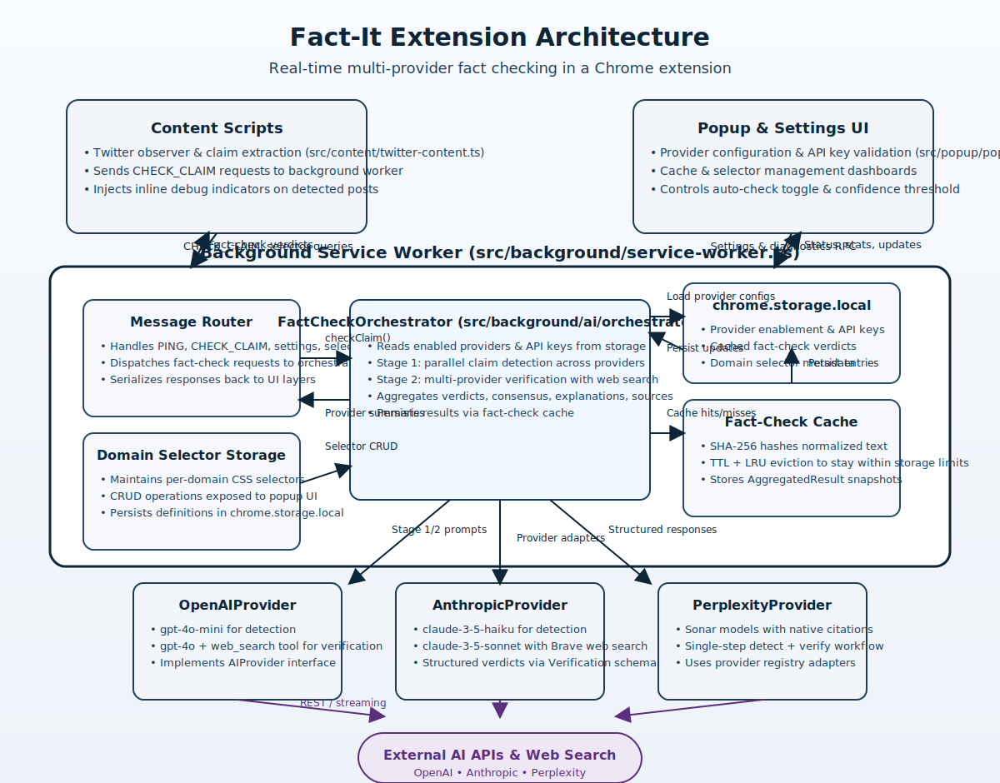

# Fact-It Architecture Overview

## Runtime flow

1. **Content scripts** monitor target sites (currently Twitter/X) for new posts, extract textual claims, and send `CHECK_CLAIM` messages to the background worker while surfacing lightweight debug indicators in the page UI.【F:src/content/twitter-content.ts†L1-L224】
2. The **background service worker** acts as the message router for all extension surfaces, exposing RPC-style handlers for fact-checking, settings, selector management, and cache maintenance.【F:src/background/service-worker.ts†L1-L205】
3. Fact-check requests are delegated to the **FactCheckOrchestrator**, which loads enabled providers from `chrome.storage.local`, runs staged claim detection and verification across the provider registry, aggregates consensus, and stores the combined result in the cache.【F:src/background/ai/orchestrator.ts†L12-L299】【F:src/background/ai/providers/registry.ts†L1-L40】
4. The orchestrator and service worker persist provider configuration, domain selectors, and cached verdicts through the **fact-check cache** utilities that hash normalized text and apply TTL/LRU eviction inside `chrome.storage.local`.【F:src/background/cache/fact-check-cache.ts†L1-L200】
5. The **popup/settings UI** reads status from the service worker, lets users manage provider API keys, adjust thresholds, inspect cache statistics, and test connectivity via message-based RPCs.【F:src/popup/popup.ts†L1-L220】

## AI provider abstraction

- Providers implement a shared `AIProvider` interface with typed schemas for claim detection and verification, ensuring consistent outputs for aggregation regardless of the underlying model or toolchain.【F:src/background/ai/providers/types.ts†L1-L120】
- The orchestrator fans out requests to specific provider adapters (OpenAI, Anthropic, Perplexity), enabling parallel reasoning and citation-backed evidence gathering before collapsing results into a single verdict for the UI surfaces.【F:src/background/ai/orchestrator.ts†L200-L299】

## Storage & configuration

- Provider enablement flags, API keys, cache entries, and selector definitions are stored in `chrome.storage.local`, with helper modules exposing CRUD flows that the popup UI surfaces for users.【F:src/background/service-worker.ts†L186-L205】【F:src/background/cache/fact-check-cache.ts†L61-L200】
- Cache statistics and selector metadata are exposed through dedicated message handlers so the popup can present diagnostics without directly accessing storage, keeping the background worker authoritative.【F:src/background/service-worker.ts†L94-L205】
